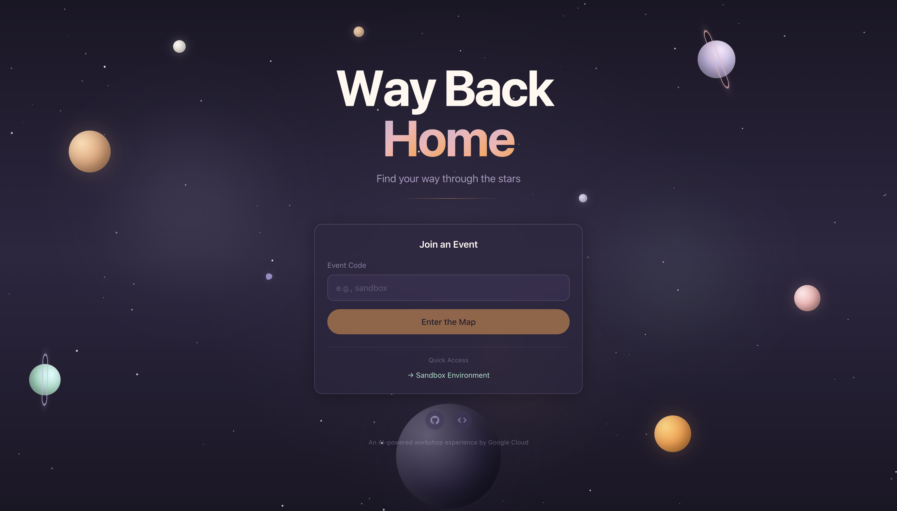

# Way Back Home - Frontend



**A beautiful 3D interactive map experience built with Next.js 14 and Three.js.**

Explorers can see themselves and others on an alien planet, track their progress through the workshop levels, and watch the community grow in real-time.

## ✨ Features

- 🌍 **3D Planet Visualization** — Interactive globe with soft pastel aesthetics
- 👥 **Real-time Participant Tracking** — See other explorers appear on the map
- 📊 **Level Progress** — Visual journey tracker through workshop levels
- ✨ **Beautiful Animations** — Floating particles, glowing orbs, smooth transitions
- 📱 **Responsive Design** — Works on desktop and mobile
- ⌨️ **Keyboard Shortcuts** — Quick controls for power users

## 🎮 Level Logic & Overrides

The application determines a user's level and progress using a **Hybrid System**:

| Level | Name | Logic Source |
| :--- | :--- | :--- |
| **0** (Identity) | Stranded | **Hybrid:** Override OR Derived from `location_confirmed` |
| **1** (Signal) |  | **Hybrid:** Override OR Implied by Level 0 completion |
| **2** (Navigate) | Explorer | **Override Only** (Firebase) |
| **3** (Journey) | Navigator | **Override Only** (Firebase) |
| **4** (Challenge) | Pathfinder | **Override Only** (Firebase) |
| **5** (Home) | Homebound | **Override Only** (Firebase) |

### Override Priority
1. **Firebase Overrides Check First:** If a participant has explicit fields in Firebase (e.g., `level_2_complete: true` or `completion_percentage: 90`), these **always** take precedence.
2. **Fallback to Derived Logic:** If no overrides are present, the system falls back to the original application logic:
   - `location_confirmed: false` → **Level 0 (Stranded)**
   - `location_confirmed: true` → **Level 1 (Survivor) Active**

This allows seamless backward compatibility for existing users while enabling advanced progression control for new features.

## 🎨 Design System

| Element | Color | Usage |
|---------|-------|-------|
| Lavender | `#C4B5E0` | Primary accent |
| Mint | `#A8E6CF` | Success/progress |
| Terracotta | `#E8A87C` | Warm ground tones |
| Peach | `#F8B4B4` | Sky/highlights |
| Orange | `#FF9F43` | Current user/CTAs |
| Cream | `#FFF8F0` | Text/UI |
| Void | `#1A1625` | Background |

**Typography:**
- **Display**: Outfit (titles, headings)
- **Body**: DM Sans (readable text)
- **Mono**: JetBrains Mono (coordinates, data)

## 🚀 Quick Start

### Prerequisites

- Node.js 18+
- npm or yarn
- Backend API running (see [backend/README.md](../backend/README.md))

### Installation

```bash
cd dashboard/frontend

# Install dependencies
npm install

# Copy environment template
cp .env.example .env.local

# Edit .env.local with your API URL
# NEXT_PUBLIC_API_URL=https://api.waybackhome.dev

# Start development server
npm run dev
```

Visit `http://localhost:3000`

### Routes

| Route | Description |
|-------|-------------|
| `/` | Landing page with event code entry |
| `/e/[eventCode]` | Event map view (e.g., `/e/sandbox`) |
| `/e/[eventCode]?me=[id]` | Map with your marker highlighted |

## 🛠️ Technology Stack

| Technology | Purpose |
|------------|---------|
| **Next.js 14** | React framework with App Router |
| **Three.js** | 3D graphics engine |
| **React Three Fiber** | React renderer for Three.js |
| **Drei** | Useful helpers for R3F |
| **Zustand** | Lightweight state management |
| **Framer Motion** | Smooth animations |
| **Tailwind CSS** | Utility-first styling |
| **TypeScript** | Type safety |

## ⌨️ Keyboard Shortcuts

| Key | Action |
|-----|--------|
| `H` | Toggle UI visibility |
| `R` | Toggle auto-rotation |
| `Esc` | Deselect participant |

## 🌐 Deployment

### Cloud Run via Cloud Build (Recommended)

Deploy both backend and frontend together from the project root:

```bash
# Deploy both services
gcloud builds submit --config cloudbuild.yaml

# Deploy only frontend
gcloud builds submit --config cloudbuild.yaml \
  --substitutions=_DEPLOY_BACKEND=false

# With custom domain URLs
gcloud builds submit --config cloudbuild.yaml \
  --substitutions=_API_BASE_URL=https://api.yourdomain.dev,_MAP_BASE_URL=https://yourdomain.dev
```

### Custom Domain Mapping

```bash
# Verify domain ownership (one-time)
gcloud domains verify yourdomain.dev

# Map domain to frontend service
gcloud beta run domain-mappings create \
  --service eurythmy-frontend \
  --domain yourdomain.dev \
  --region us-central1
```

### Alternative: Vercel

```bash
# Install Vercel CLI
npm install -g vercel

# Deploy
vercel
```

Set the environment variable in Vercel dashboard:
- `NEXT_PUBLIC_API_URL`: Your backend API URL

## 🎨 Customization

### Particle Effects

Edit `components/three/Particles.tsx`:

```tsx
// Add new colors to the palette
const colors = ['#C4B5E0', '#A8E6CF', '#YOUR_COLOR']
```

### Planet Appearance

Edit `components/three/Planet.tsx`:

```tsx
// Modify the surface gradient
gradient.addColorStop(0, '#YOUR_COLOR')
```

### Level Names

Edit `lib/store.ts`:

```tsx
export function getLevelName(level: number): string {
  const names = ['Your', 'Custom', 'Names', 'Here']
  return names[Math.min(level, names.length - 1)]
}
```

## 🐛 Troubleshooting

| Issue | Solution |
|-------|----------|
| Three.js not rendering | Ensure using `ssr: false` in dynamic import |
| API connection issues | Check `NEXT_PUBLIC_API_URL` in `.env.local` |
| CORS errors | Ensure backend allows your frontend origin |
| Slow performance | Reduce particle count, disable auto-rotate on mobile |

### Three.js SSR Fix

Always use dynamic imports for 3D components:

```tsx
const Scene3D = dynamic(() => import('@/components/three/Scene'), {
  ssr: false, // Required for Three.js
})
```

## 📝 License

Apache 2.0 - See [LICENSE](../../LICENSE) file in the repository root.

---

*Watch the explorers find their way home.* 🌍