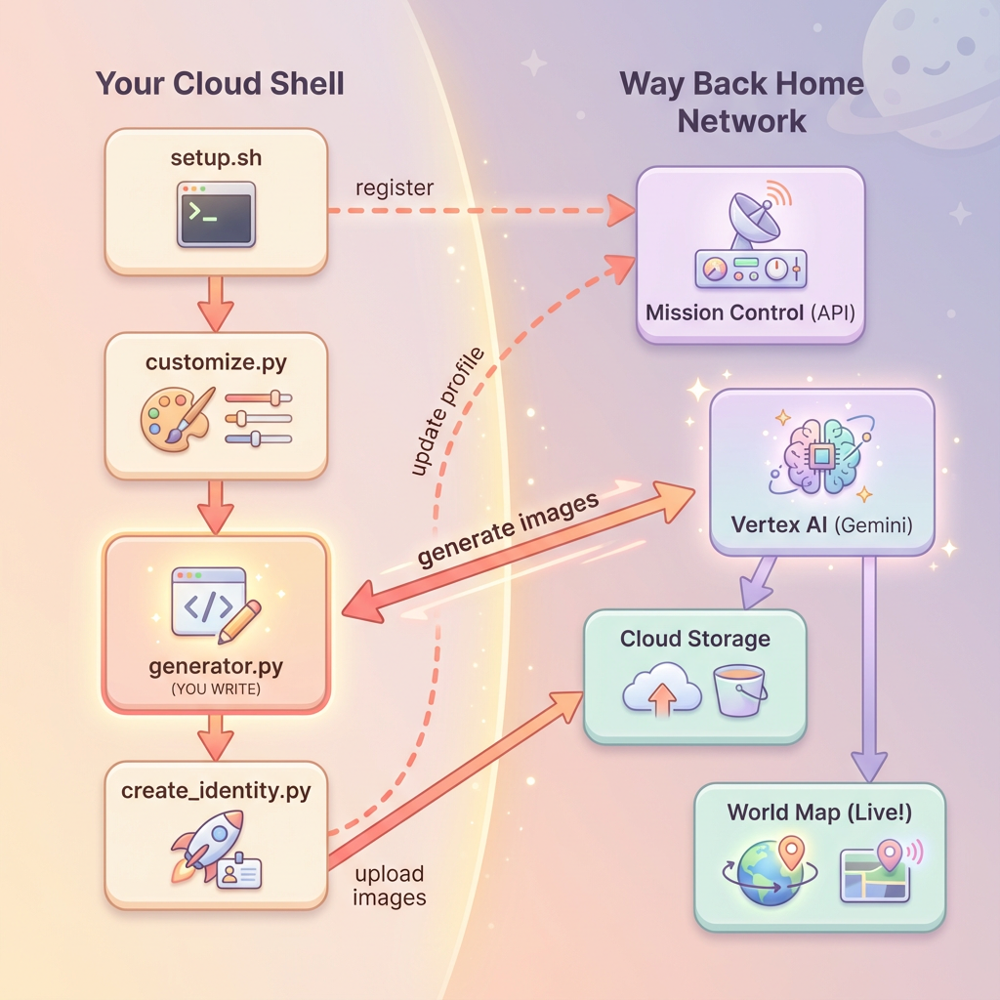

# Level 0: Identify Yourself



**Generate your unique space explorer avatar using multi-turn image generation with Gemini.**

Your escape pod has crash-landed on an unknown world. The rescue network can't locate unregistered explorers—you need to exist in the system before anyone can find you. In this level, you'll create your explorer identity using AI-powered image generation.

## 🎯 What You'll Learn

| Concept | Description |
|---------|-------------|
| **Multi-turn Image Generation** | Maintain character consistency across multiple images using chat sessions |
| **Prompt Engineering** | Craft effective prompts for stylized, consistent outputs |
| **Gemini Image API** | Use Gemini's native image generation (Nano Banana 🍌) via Python SDK |
| **Chat Sessions** | Leverage conversation context for iterative refinement |

## ✅ What You'll Build

By the end of this level, you will have:

- 🎨 Generated a **portrait** of your explorer using text-to-image AI
- 🖼️ Created a consistent **map icon** using multi-turn conversation
- 📍 Registered your identity with the rescue network
- 🗺️ Appeared on the live world map alongside other explorers

## 📋 Prerequisites

- Google Cloud project with billing enabled
- Cloud Shell access (or local Python 3.11+ environment)
- ~10 minutes of time

## 🚀 Quick Start

### 1. Set Up Environment

```bash
cd ~/eurythmy

# Enable Vertex AI API
gcloud services enable aiplatform.googleapis.com

# Navigate to Level 0
cd level_0

# Create virtual environment
python -m venv .venv
source .venv/bin/activate
pip install -r requirements.txt
```

### 2. Connect to Mission Control

```bash
cd ~/eurythmy
./scripts/setup.sh
```

Enter your **event code** (from workshop instructor or use `sandbox` for self-learning) and choose your **explorer name**.

### 3. Customize Your Explorer

```bash
cd level_0
python customize.py
```

Select your suit color and describe your explorer's appearance.

### 4. Complete the Generator Code

Open `generator.py` and implement the three TODO sections:

1. **Create chat session** for multi-turn generation
2. **Generate portrait** with your customizations
3. **Generate icon** using the same chat session for consistency

### 5. Create Your Identity

```bash
python create_identity.py
```

Watch as your avatar is generated, uploaded, and registered. Then visit the world map to see yourself!

## 📖 Full Codelab

For detailed step-by-step instructions with explanations:

**[📚 Level 0 Codelab →](https://codelabs.developers.google.com/eurythmy-level-0/instructions)**

## 🔑 Key Concepts

### Multi-Turn Chat for Character Consistency

The secret to generating consistent characters is using a **chat session**:

```python
# Create chat session
chat = client.chats.create(
    model="gemini-2.5-flash-image",
    config=types.GenerateContentConfig(
        response_modalities=["TEXT", "IMAGE"]
    )
)

# Turn 1: Generate portrait
portrait_response = chat.send_message(portrait_prompt)

# Turn 2: Generate icon (same session = same character!)
icon_response = chat.send_message(icon_prompt)
```

Without the chat session, each API call would generate a completely different-looking person.

### Prompt Structure

Effective image prompts follow this pattern:

1. **Subject definition** — What to create
2. **Variable injection** — User customizations
3. **Style requirements** — Artistic direction
4. **Technical constraints** — Background, framing, etc.

## 💰 Cost

| Item | Approximate Cost |
|------|-----------------|
| Portrait (1024×1024) | ~$0.04 |
| Icon (1024×1024) | ~$0.04 |
| **Total** | **~$0.08** |

## 🐛 Troubleshooting

| Issue | Solution |
|-------|----------|
| "No module named 'google.genai'" | Activate venv: `source .venv/bin/activate` |
| "Failed to generate portrait" | Check appearance description for restricted content |
| "GOOGLE_CLOUD_PROJECT not set" | Run: `export GOOGLE_CLOUD_PROJECT=$(gcloud config get-value project)` |
| Avatar not on map | Wait 5-10 seconds for polling, or hard refresh the page |

## 📁 Files Overview

| File | Purpose |
|------|---------|
| `customize.py` | Interactive suit color and appearance selection |
| `generator.py` | **Your code goes here** — image generation logic |
| `create_identity.py` | Orchestrates generation, upload, and registration |
| `requirements.txt` | Python dependencies |

## ➡️ Next Level

Once your beacon is pulsing on the map, proceed to:

**[Level 1: Pinpoint Your Location →](../level_1/README.md)**

Build a multi-agent AI system to analyze your crash site and confirm your exact coordinates!

---

*Your beacon awaits activation, explorer.* 🚀
