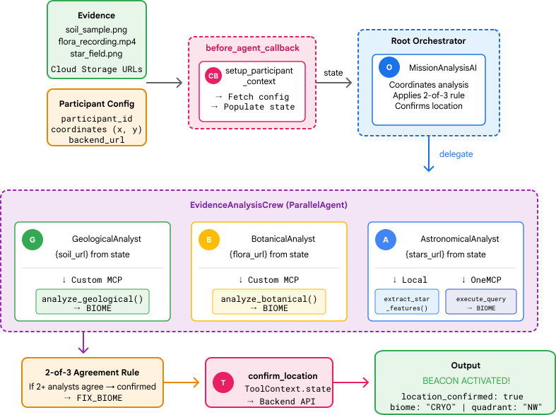

# Level 1: Pinpoint Your Location



**Build a multi-agent AI system to analyze crash site evidence and confirm your exact coordinates.**

Your beacon is pulsing—but it's barely a flicker. The rescue teams can see *something* at your coordinates, but they can't get a lock. To boost your signal to full strength, you need to analyze the evidence scattered across your crash site and determine exactly which region of the planet you're in.

## 🎯 What You'll Learn

| Concept | Description |
|---------|-------------|
| **Multi-Agent Systems** | Build specialized agents with single responsibilities |
| **ParallelAgent** | Run independent analyses concurrently |
| **before_agent_callback** | Fetch configuration and set state before agent execution |
| **{key} State Templating** | Access state values in agent instructions |
| **ToolContext** | Access state values within tool functions |
| **Custom MCP Servers** | Build tools with FastMCP on Cloud Run |
| **Google Cloud MCP server for BigQuery** | Connect to Google's managed MCP for database access |
| **Multimodal AI** | Analyze images and video+audio with Gemini |

## ✅ What You'll Build

By the end of this level, you will have:

- 🔬 Deployed a **custom MCP server** for geological and botanical analysis
- 🤖 Created **three specialist agents** running in parallel
- 🔗 Connected to **Google Cloud MCP server for BigQuery** for star catalog queries
- 🎯 Built a **root orchestrator** with 2-of-3 consensus logic
- 🔦 **Activated your beacon** at full strength!

## 📋 Prerequisites

- ✅ **Level 0 completed** — You must have `config.json` with your participant data
- ✅ Avatar visible on the world map
- ✅ Google Cloud project with Vertex AI enabled

## 🚀 Quick Start

### 1. Set Up Environment

```bash
cd ~/eurythmy/level_1

# Run environment setup (enables APIs, creates service account)
chmod +x setup/setup_env.sh
./setup/setup_env.sh

# Source environment variables
source ~/eurythmy/set_env.sh

# Create virtual environment
python -m venv .venv
source .venv/bin/activate
pip install -r requirements.txt

# Set up star catalog in BigQuery
python setup/setup_star_catalog.py
```

### 2. Generate Crash Site Evidence

```bash
python generate_evidence.py
```

This creates personalized evidence (soil sample, flora video, star field) based on your crash coordinates.

### 3. Build & Deploy MCP Server

```bash
cd mcp-server
pip install -r requirements.txt

# Implement the tools in main.py (see #REPLACE sections)

# Deploy to Cloud Run
gcloud builds submit . \
  --config=cloudbuild.yaml \
  --substitutions=_REGION="$REGION",_REPO_NAME="$REPO_NAME",_SERVICE_ACCOUNT="$SERVICE_ACCOUNT"

# Save the URL
export MCP_SERVER_URL=$(gcloud run services describe location-analyzer \
  --region=$REGION --format='value(status.url)')
```

### 4. Build the Agent System

Implement the placeholder sections in:

| File | What to Implement |
|------|-------------------|
| `agent/tools/mcp_tools.py` | MCP connection to your Cloud Run server |
| `agent/tools/star_tools.py` | Gemini Vision + Google Cloud MCP server for BigQuery connection |
| `agent/tools/confirm_tools.py` | Location confirmation with ToolContext |
| `agent/agents/geological_analyst.py` | Soil analysis specialist |
| `agent/agents/botanical_analyst.py` | Flora analysis specialist |
| `agent/agents/astronomical_analyst.py` | Star triangulation specialist |
| `agent/agent.py` | Callback, ParallelAgent, and root orchestrator |

### 5. Test Locally

```bash
cd ~/eurythmy/level_1
source ~/eurythmy/set_env.sh
adk web
```

Open the web preview on port 8000 and send: *"Analyze the evidence and confirm my location."*

### 6. Deploy to Cloud Run

```bash
adk deploy cloud_run \
  --project=$GOOGLE_CLOUD_PROJECT \
  --region=$REGION \
  --service_name=mission-analysis-ai \
  --with_ui \
  --a2a \
  ./agent

# Set environment variables
gcloud run services update mission-analysis-ai \
  --region=$REGION \
  --set-env-vars="GOOGLE_CLOUD_PROJECT=$GOOGLE_CLOUD_PROJECT,GOOGLE_CLOUD_LOCATION=$REGION,MCP_SERVER_URL=$MCP_SERVER_URL,BACKEND_URL=$BACKEND_URL,PARTICIPANT_ID=$PARTICIPANT_ID,GOOGLE_GENAI_USE_VERTEXAI=True"
```

## 📖 Full Codelab

For detailed step-by-step instructions with explanations:

**[📚 Level 1 Codelab →](https://codelabs.developers.google.com/eurythmy-level-1/instructions)**

## 🏗️ Architecture

```
┌─────────────────────────────────────────────────────────────────┐
│                    Mission Analysis AI                           │
├─────────────────────────────────────────────────────────────────┤
│                                                                  │
│   ┌──────────────────────────────────────────────────────────┐  │
│   │  before_agent_callback                                    │  │
│   │  • Fetches participant data from backend API              │  │
│   │  • Sets state: soil_url, flora_url, stars_url, etc.       │  │
│   └──────────────────────────────────────────────────────────┘  │
│                              │                                   │
│                              ▼                                   │
│   ┌──────────────────────────────────────────────────────────┐  │
│   │  Root Orchestrator (MissionAnalysisAI)                    │  │
│   │  • Coordinates analysis crew                              │  │
│   │  • Applies 2-of-3 consensus rule                          │  │
│   │  • Calls confirm_location tool                            │  │
│   └──────────────────────────────────────────────────────────┘  │
│                              │                                   │
│                              ▼                                   │
│   ┌──────────────────────────────────────────────────────────┐  │
│   │  ParallelAgent (EvidenceAnalysisCrew)                     │  │
│   │                                                           │  │
│   │  ┌─────────────┐ ┌─────────────┐ ┌─────────────────────┐ │  │
│   │  │ Geological  │ │ Botanical   │ │ Astronomical        │ │  │
│   │  │ Analyst     │ │ Analyst     │ │ Analyst             │ │  │
│   │  │             │ │             │ │                     │ │  │
│   │  │ {soil_url}  │ │ {flora_url} │ │ {stars_url}         │ │  │
│   │  └──────┬──────┘ └──────┬──────┘ └──────────┬──────────┘ │  │
│   └─────────│───────────────│───────────────────│────────────┘  │
│             │               │                   │                │
│             ▼               ▼                   ▼                │
│   ┌─────────────────┐ ┌─────────────────┐ ┌──────────────────┐  │
│   │  Custom MCP     │ │  Custom MCP     │ │ Google Cloud MCP │  │
│   │  (Cloud Run)    │ │  (Cloud Run)    │ │ server (BQ)      │  │
│   │                 │ │                 │ │                  │  │
│   │ analyze_        │ │ analyze_        │ │ execute_query    │  │
│   │ geological      │ │ botanical       │ │ (star_catalog)   │  │
│   └─────────────────┘ └─────────────────┘ └──────────────────┘  │
│                                                                  │
└─────────────────────────────────────────────────────────────────┘
```

## 🔑 Key Patterns

### before_agent_callback + State Sharing

```python
async def setup_participant_context(callback_context: CallbackContext) -> None:
    # Fetch from backend API
    response = await client.get(f"{backend_url}/participants/{participant_id}")
    data = response.json()
    
    # Set state for all sub-agents
    callback_context.state["soil_url"] = data["evidence_urls"]["soil"]
    callback_context.state["flora_url"] = data["evidence_urls"]["flora"]
    callback_context.state["stars_url"] = data["evidence_urls"]["stars"]

root_agent = Agent(
    name="MissionAnalysisAI",
    before_agent_callback=setup_participant_context,
    ...
)
```

### {key} State Templating

Sub-agents access state via `{key}` placeholders in their instructions:

```python
geological_analyst = Agent(
    instruction="""
    ## YOUR EVIDENCE
    Soil sample URL: {soil_url}
    
    Call analyze_geological with the URL above...
    """,
    ...
)
```

### Two MCP Patterns

| Pattern | When to Use | Example |
|---------|-------------|---------|
| **Custom MCP** | Custom AI logic, domain-specific processing | `location-analyzer` on Cloud Run |
| **Google Cloud MCP servers** | Standard database/API access | `bigquery.googleapis.com/mcp` |

## 🌍 The Planet's Biomes

| Biome | Quadrant | Geological | Botanical | Astronomical |
|-------|----------|------------|-----------|--------------|
| 🧊 CRYO | NW | Ice crystals, frozen methane | Frost ferns | Blue giant star |
| 🌋 VOLCANIC | NE | Obsidian, magma veins | Fire blooms | Red dwarf binary |
| 💜 BIOLUMINESCENT | SW | Phosphorescent soil | Glowing fungi | Green pulsar |
| 🦴 FOSSILIZED | SE | Amber deposits | Petrified trees | Yellow sun |

## 💰 Cost

| Component | Approximate Cost |
|-----------|-----------------|
| Evidence generation (Gemini + Veo) | ~$0.10 |
| Agent execution (~5 tool calls) | ~$0.05 |
| **Total per participant** | **~$0.15** |

## 🐛 Troubleshooting

| Issue | Solution |
|-------|----------|
| "MCP_SERVER_URL not set" | Run: `source ~/eurythmy/set_env.sh` |
| "PARTICIPANT_ID not set" | Complete Level 0 first, then re-run `setup_env.sh` |
| "BigQuery table not found" | Run: `python setup/setup_star_catalog.py` |
| Specialists asking for URLs | Ensure `before_agent_callback` is set on root agent |
| All three analyses disagree | Regenerate evidence: `python generate_evidence.py` |

## ➡️ Next Level

Once your beacon is shining bright, proceed to:

**[Level 2: Process SOS Signals →](../level_2/README.md)** *(Coming Soon)*

Learn to receive and process distress signals from other survivors using event-driven agent patterns!

---

*Your beacon is now broadcasting at full strength. Rescue is on the way.* 🔦
